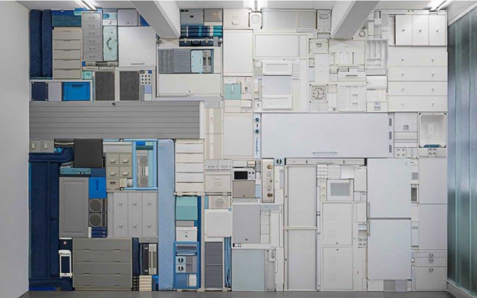

Big software is made of time, effort from lots of people and code that gets layered on top of each other.I’m sure you heard people talk about the foundations of software architecture, that the next project will be absolutely perfect and not rushed in any way.The idealistic dream of starting from scratch, we've all been there.As each feature is added, increasing the size of system layers, those features become the building blocks of your software. They get layered on top of each other and your team sure stack’em high and ship as fast as possible.Here are a few lessons Tetris can teach us about building software and something called technical debt​.

## 1 - Tidy layers make your stack easy to maintain and to add more features

Once a layer of software is clean enough, you shouldn't have to fight it. Code modules are tools in your stack, they should be easy to work with and not get in your way.Like Tetris lines that vanish from the view, our workspace now has more space to work with,more flexibility to add features on top of it and no hidden gaps or cruft.It’s not healthy to have a cold dark place in your codebase people is constantly afraid to touch.

## 2 - Old gaps are hard to get rid of

The more gaps you leave in your code to fix later or something overly complex that is “for future use” and never gets used — also known as over-engineering — less space you have to work with and the more you’ll have to keep that hidden gotcha in mind while coding your software.Thus making your team less productive over time with overhead.Your software becomes a minefield, fragile and hard to maintain, so the earlier you break those apart and fix the bad code the cheaper it becomes.Time is a key element in both software and Tetris, so it’s our job to keep it open for extension in case any unexpected piece comes in rushing to be pushed to production.

## 3 - Your modules should be easily stackable

Like Tetris pieces, your modules too should have a coherent, easy to understand way to use.Their interface should be simple.By avoiding to expose internal functionality of your module to the outside world you are preventing confusion and providing a single purpose interface with a one true way of making it work.If you can’t figure out your module’s shape, you’ll never know for sure how it fits in your software.Simpler shapes are really easy to deal with. Imagine a Tetris game only composed of straight lines, it’s so manageable it’s boring. Because it’s a game, you want challenge, but in software you want things to go smooth. Simpler parts are better parts.

## 4 - Avoid coding a feature logic through several layers

If your feature is not modular or centralized in a few service objects you can easily end up with that upside down ​L shaped piece​ stuck in the corner with several layers having to deal with that feature’s responsibilities.Having your feature all in one place with small pieces being called explicitly from it’s dependants instead of having its parts implemented directly is not as straightforward and intuitive as it sounds. Don’t be afraid to spawn new objects to deal with different problems.

## 5 - Unlike Tetris, the next piece shouldn't matter

Your piece of software should make sense based on what it’s built for, that is, not depend on how​ it was built but ​for what​ it was built.The trick here is to always code based on the business problem you want to solve and not on how your other modules behave or what quirks they might have.
Once your module is doing one thing, and doing it well, your system shouldn't know about it's internal implementations, in case you replace that piece later. Something you can’t do in Tetris.That also makes your “blocks” more testable as you can mock any inputs they might need.

## Conclusion

We all want our software to fit in the client’s expectations, even when their expectations and needs change.So in your next project, keep in mind that the best you can do about its architectural quality is to keep those layers gap less and have plenty of workspace to twist and place your little code blocks in this crazy tower of software
