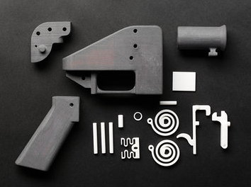
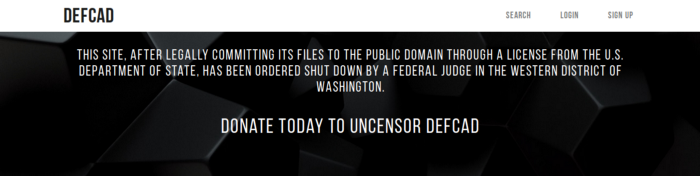

Tem um cara aí, o nome dele é Cody Wilson. Ele é um anarcocaptalista que tem uma empresa chamada Defense Distributed, que é focada em fabricar uma impressora 3D para produzir armas de fogo, a Ghost Gunner.

Essa maravinha libertária rendeu para Cody o título de um dos homens mais perigosos da terra do tio Trump, que inclusive também está na última lista da Wirez. Na verdade, ele apareceu nas listas de mais perrigoso umas três vezes, duas dos EUA(2013 e 2015) e uma da Internet(2017). É, liberdade é uma ideia perigosa…

Legal né? Não para por aí, a DD também desenvolveu o Liberator, uma arma que pode ser feita com impressoras 3D comuns. Mas como ela é feita de plástico ABS (e não de metal como as armas feitas pela Ghost Gunner) provavelmente não durará mais do que 3 tiros, por isso a chamo de descartável.

As armas artesanais sempre existiram desde que o mundo é mundo, mas a possibilidade de fazê-las com plástico na própria garagem pode dar ao povo o poder a muito tempo tirado pelos governates: a capacidade de se defender.

Você até pode não ser um libertário, mas tem que concordar que o Estado sobrevive graças ao monopólio da violência, logo qualquer tentativa de dar armas para as pessoas comuns é uma afronta maior ao domínio estatal do que as dar para criminosos. Uma gangue de ladrões armados não tem o potencial revolucionário que uma população armada tem. Não à toa, o Facebook está começando a banir os links de compartilhamento dos projetos, isso é um golpe muito mais fundo do que aquela treta com o MBL.

Os projetos do Liberator tornam qualquer tentativa de controle de armas impraticável pois, como não tem número de série, qualquer um que tenha uma impressora 3D em casa pode ter uma arma para chamar de sua. A única forma de impedir que isso acontecesse seria cortar a liberdade da internet, mas, como o Pirate Bay mostrou, isso não daria muito certo. Além do mais, armas convencionais são completamente rastreáveis e têm privacidade zero, basta você dizer aos seus vizinhos que tem uma arma não registrada que maior parte deles vai te colocar do mesmo lado que os traficantes e milicianos das favelas do Rio.

> “Toda a atitude do cypherpunk de total privacidade de armas é mais coerente agora. Você pode ter uma 1911 ou uma glock privada, e está no nível de fabricação automatizada” ~ Cody Wilson

A Ghost Gunner é capaz de produzir peças de Glock e AR-15 sem número de série. E eu esqueci de dizer que tanto a impressora quanto as peças de armas separadas podem ser compradas com bitcoins. Isso não é novidade já que o Sr Wilson também é um desenvolvedor do Bitcoin, já trabalhando com Amir Taaki, um programador ex-militar e anarquista. Dá pra perceber que eu queria ter esses dois no Telegram né?

E esse é só o começo. Como as criações da DD são open-source, ou seja, abertas para criar e distribuir, é uma questão de tempo até a comunidade começar a melhorar o projeto. Mas a questão que não quer calar é: quando eu vou poder ir comprar pão num tanque de guerra?

## Ok, mas eu não tenho impressora 3D, como faço pra dar tiro em vagagundo?

Para os meros mortais aqui do Brasil, pagar 1700 Trumps numa Grost Gunner é impraticável, ainda mais quando se para pra pensar na questão da importação, impostos e, principalmente, se ter uma fucking impressora 3D para fazer armas é ilagal por aqui. Nos EUA, pelo menos você poderia apelar para a gloriosa Segunda Emenda, que garante aos cidadãos o direito de portar armas e formar milícias, mas no Brasil a coisa é diferente, ninguém faz a mínima ideia do que fazer se uma coisas dessa vir para cá. É clássico caso de “vale o que o delegado e o juíz acharem”. No caso do Liberator, minha melhor dica para você é não tirá-la de casa ou do carro, a mantenha sempre sem munição e, caso alguma “autoridade” te barrar, pinte a arma de laranja e diga que é um brinquedo, talvez a desculpa cole.

Mas eu ainda não respondi como você pode arrumar uma impressora 3D comum e mesmo assim manter seu rim. Tem alguns projetos de impressoras 3D DIY pela Internet, ou seja, engenhocas que você mesmo pode fazer. Não é fácil fazer uma dessas, mas é muito mais barato do que uma pronta. Um desses projetos é o RapRap, que tenta fazer uma coisa parecida com o mostro Frankenstein, impressoras 3D que se auto replicam. Exitem vários modelos, de diferentes capacidades e recursos.

Embora as RapRap’s sejam legais e tal, a minha favorita é essa aqui. Ela é feita desmontando drivers de disquete e CD de computadores antigos, com poucas peças que precisam ser compradas. **Qual é o preço dessa brincadeira? 60 dólares!**

## Viva la liberté

Após uma batalha judicial pela divulgação dos projetos, Cody Wilson e a DD ainda não conseguiram a liberação. #chatedado Mas isso não significa que você não possa ter os projetos das armas deles. Como eu sou muito gente boa e sei que você não vai fazer merda com eles, encontrei todos os projetos de armas e um pouco mais nesse repositório do GitHub aí em baixo. Sugiro que, mesmo que você não tenha intenção de imprimir os projetos, baixe e os deixe a salvo caso alguma coisa aconteça com o link.

[maduce/fosscad-repo](https://github.com/maduce/fosscad-repo)

Eu acredito que Cody Wilson vai fazer pela liberação das armas, o que Ross Ulbrucht fez com o Silk Road pela liberação das drogas e Satoshi Nakamoto fez pela desestatização do dinheiro com o Bitcoin.

Por um mundo onde essa cena do South Park seja realidade…

> “Nenhum homem livre pode ser privado do uso de armas”
~ Thomas Jefferson

## Dicas de Leitura
- Vamos começar as recomendações dessa edição com [a entrevista que o nosso amigo Cody deu para a Reason TV](https://www.youtube.com/watch?v=-_ayHfaHCXQ), que mostra toda a obra da Defense Distributed e as opiniões do anarquista (recomendo que use a tradução automática de legentdas no YouTube).

- [“Compre Sua Impressora 3D para Fabricar Armas com Bitcoin”](https://portaldobitcoin.com/compre-sua-impressora-3d-para-fabricar-armas-com-bitcoin/), o título dessa matéria do Portal do Bitcoin já é auto-explicativo, é o melhor texto em português que eu achei sobre o assunto.

- [Esse documentário de 24 min da Motherboard chamado “Click. Print. Gun.”](https://www.youtube.com/watch?v=DconsfGsXyA) é antigo (2013), antes do Liberator e da Grost Gunner, mas mesmo assim é uma das melhores entrevistas com ele e mostra bem como a luta começou.

- [Esse artigo da Mises Brasil, escrito por Jacob Hornberger](https://www.mises.org.br/Article.aspx?id=954), é uma excelente argumentação de porque o direito ao porte de armas é o direito que precede todos os outros.

- [Esse vídeo de menos de 5 minutos](https://www.washingtonpost.com/video/national/this-3d-gunmaker-is-taking-on-the-state-and-hes-winning/2018/08/08/59c0e9fa-9b6c-11e8-a8d8-9b4c13286d6b_video.html?noredirect=on) é de uma entrevista em inglês do Cody Wilson para o The Washington Post. Nesse vídeo ele demonstra o uso da Liberator e argumenta se os americanos deveriam imprimir armas que não seriam regulamentadas nem rastreáveis.

- [Nesse artigo da Buzz Feed News americana](https://www.buzzfeednews.com/amphtml/josephbernstein/facebook-to-ban-3d-printed-gun-files-from-its-platforms) (pode clicar, é reportagem das boas) é exposto a forma que o Foiceberg bloqueia o compartilhamento de arquivos de armas impressas em 3D dentro da plataforma, inclusive no Messenger. Aqui se aplica o mesmo caso do banimento de páginas lá, porém com essa reportagem fica bem claro de que lado o tio Mark está e já não é novidade para ninguém.

## Carta aos leitores
Olá, essa é a parte do post que eu falo um pouco sobre o rumo que as coisas no blog estão tomando e sobre a experiência que foi escrever sobre o tema. Esse post me deu um empenho a mais, já que eu estava muito ansioso para o dia 1 de agosto, já que esse seria o dia em que a justiça americana liberaria os downloads dos planos da armas. Já imaginou a minha cara quando, ao abrir o site do DEFCAD, a Wikipédia do download de armas, apareceu essa página:

Sim, mesmo após a justiça permitir, os Democratas entraram com uma ação com os estados para derrubar o site. Deu raiva, muita raiva. Mas eu tenho que agradecer aos desembargadores que tomaram essa decisão, pois foi numa longa manhã, encontrando os arquivos e os compartilhando com toda comunidade libertária no Brasil, que eu conheci a Roze, a colaboradora desses artigos. Ela e a SAL (leia o tópico abaixo pra saber o que significa) me ajudaram demais com o compartilhamento dos arquivos. E num país como o nosso, com uma taxa de homicídio superior a países em guerra, tem uma arma em casa pode ser questão de vida ou morte.

Vou continuar escrevendo até não poder mais, ajudar a liberdade é um dos motivos que me faz levantar a cada dia, não importa se der view ou não. E a você, caro leitor, só peço o seu sincero feedback e que, caso tenha gostado, compartinhe para ajudar. O próximo artigo será um memorial do libertarianismo, as pessoas que mais fizeram para ajudar a liberdade a prosperar, ou seja, não vão aparecer filósofos teóricos, e sim gente que realmente desafiou o Estado e fez por onde para merecer o ódio dos socialistas.

## A equipe por trás desse artigo

Todo texto que eu escrevo envolve outras pessoas, tanto para a arte da capa e imagens, quanto averiguar informações e ajudar nos links das Dicas de Leitura. Também tenho que agradecer a todos os admins de pages que compartilharam meus artigos, pois assim cada vez mais pessoas os podem ler. Estou aceitando parcerias para integrar a equipe, chama no Twitter, mas não se esqueça: nenhum desses textos tem propriedade intelectual.

- Pedro — Correspondente de Oceânia, membro da Chancelaria e amigo íntimo de Goldstein. Sou eu que escrevo os textos e dou essa pitada de humor que vcs tanto gostam. Minha paixão é computação e hacking.

- Rozana Oliveira (@Rooziee) — Uma das CEO e administradora da página Sociedade Alternativa Libertária (SAL para os mais íntimos). Dentre os diversos meios de comunicação do qual participamos, sou mais ativa no Twitter @s_libertaria e conheci o Pedro nesse canal. Me formei em curiosidade pela faculdade da vida. Tenho 32 anos e dois filhos lindos que amo mais que cachorro quente.

- Natsumi Tsuji — Designer das capas.
